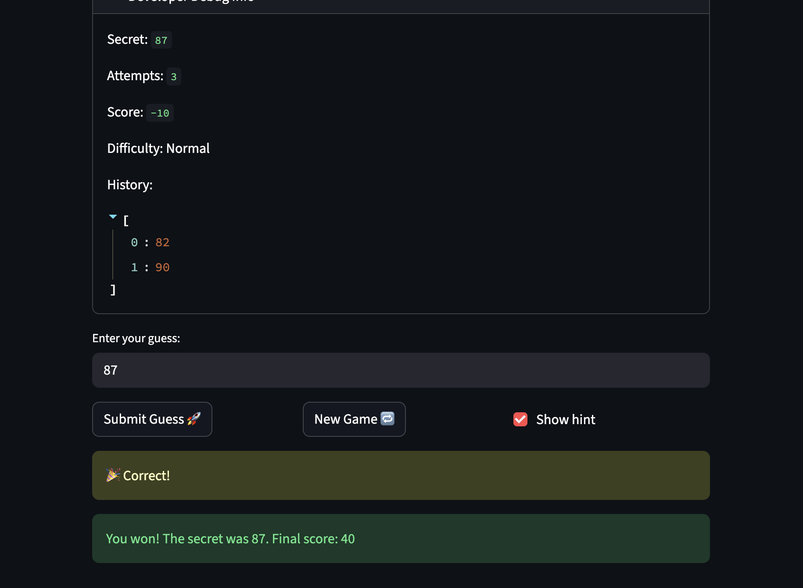

# 🎮 Game Glitch Investigator: The Impossible Guesser

## 🚨 The Situation

You asked an AI to build a simple "Number Guessing Game" using Streamlit.
It wrote the code, ran away, and now the game is unplayable. 

- You can't win.
- The hints lie to you.
- The secret number seems to have commitment issues.

## 🛠️ Setup

1. Install dependencies: `pip install -r requirements.txt`
2. Run the broken app: `python -m streamlit run app.py`

## 🕵️‍♂️ Your Mission

1. **Play the game.** Open the "Developer Debug Info" tab in the app to see the secret number. Try to win.
2. **Find the State Bug.** Why does the secret number change every time you click "Submit"? Ask ChatGPT: *"How do I keep a variable from resetting in Streamlit when I click a button?"*
3. **Fix the Logic.** The hints ("Higher/Lower") are wrong. Fix them.
4. **Refactor & Test.** - Move the logic into `logic_utils.py`.
   - Run `pytest` in your terminal.
   - Keep fixing until all tests pass!

## 📝 Document Your Experience

- [] Describe the game's purpose.
  A number guessing game where the player tries to guess a secret number within a limited number of attempts. The difficulty setting controls the number range and attempt limit. Players earn points for winning, with fewer points the more attempts they use.

- [] Detail which bugs you found.
  1. **Hard difficulty range was easier than Normal** — Hard used 1–50 while Normal used 1–100, making Hard the easiest difficulty.
  2. **Attempts initialized to 1 instead of 0** — caused off-by-one errors in the attempts-left counter and score calculation.
  3. **Info message hardcoded "1 to 100"** — the range hint didn't update to reflect the selected difficulty.
  4. **New Game reset ignored difficulty** — `random.randint(1, 100)` was hardcoded instead of using the difficulty range.
  5. **Invalid guesses consumed an attempt** — the attempt counter incremented before input validation, so typing gibberish wasted a turn.
  6. **Scoring asymmetry for "Too High"** — "Too High" alternated between +5 and -5 points based on attempt parity, while "Too Low" always deducted 5. Wrong guesses should never reward points.
  7. **Secret number changed when difficulty switched** — the old secret persisted when switching difficulty, leaving a secret that could be out of the new range.

- [] Explain what fixes you applied.
  1. Updated `get_range_for_difficulty` so Hard uses a larger range than Normal.
  2. Changed `st.session_state.attempts` initialization from `1` to `0`.
  3. Updated the info message to use `{low}` and `{high}` variables.
  4. Updated the New Game button to use `get_range_for_difficulty(difficulty)` for the correct range.
  5. Moved `st.session_state.attempts += 1` to after successful input validation.
  6. Removed the `attempt_number % 2` branch from `update_score` so "Too High" always deducts 5.
  7. Added a difficulty check to the session state guard so the secret regenerates when difficulty changes.

## 📸 Demo

## 🚀 Stretch Features

- [ ] [If you choose to complete Challenge 4, insert a screenshot of your Enhanced Game UI here]
